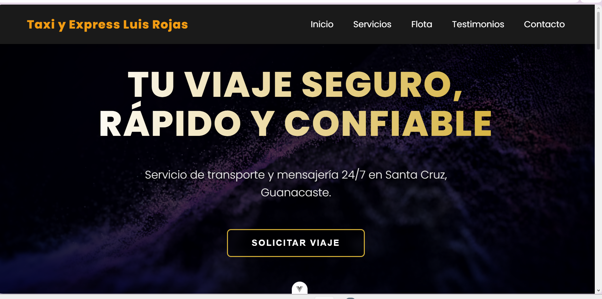
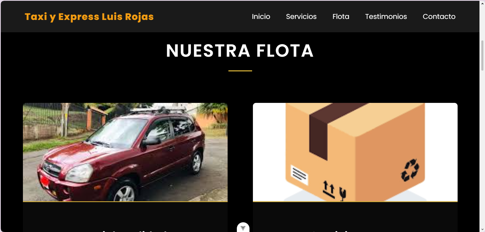
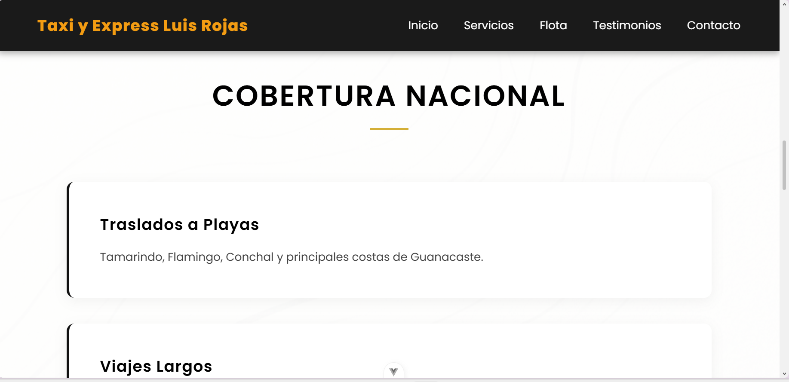
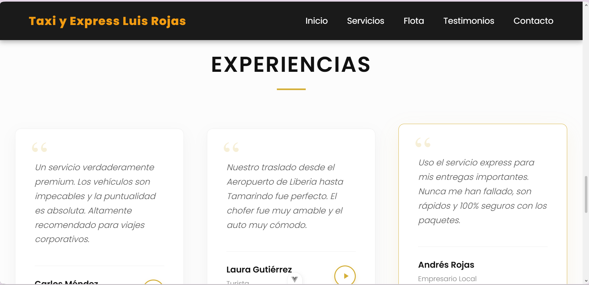
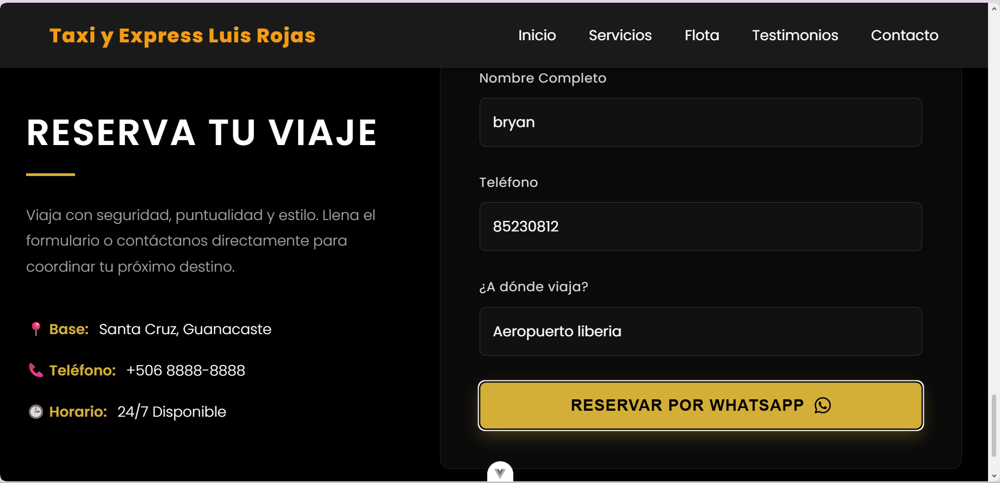

# Taxi y Express Luis Rojas

Aplicación web moderna para un servicio de transporte y mensajería 24/7 en Santa Cruz, Guanacaste. Basada en el servicio de taxi de mi padre.

##  Framework y Tecnologías Utilizadas

Este proyecto fue desarrollado utilizando **Vue 3** mediante la **Composition API** (`<script setup>`).
Se utilizó **Vite** como herramienta de construcción y empaquetado (bundler) para brindar una experiencia de desarrollo rápida y optimizada.

##  Cómo correr el programa

Para ejecutar este proyecto de forma local en la computadora, sigue estos pasos:

1. **Abra una terminal** en la carpeta raíz del proyecto (donde se encuentra este archivo `README.md`).
2. **Instala las dependencias** ejecutando el siguiente comando:
   ```bash
   npm install
   ```
3. **Inicia el servidor de desarrollo** con el comando:
   ```bash
   npm run dev
   ```
4. **Abrir el navegador** y visite la dirección local que te muestra la terminal (generalmente `http://localhost:5173/`).

##  Vistas de la Aplicación

A continuación, se presentan algunas capturas de las diferentes secciones del proyecto:

### Inicio


### Nuestra Flota


### Cobertura Nacional


### Experiencias (Testimonios)


### Contacto y Reservas



